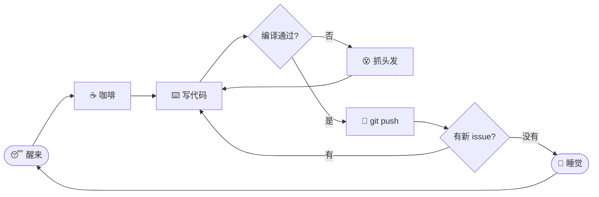

  
  
  

### `❯ whoami`

### 🗺️ 冒险日志 · Quest Log

| | 任务 | 状态 |
|:-:|:--|:-:|
| ⚔️ | **主线** · [AstaPS](https://github.com/MeChen618/AstaPS) — 优化过的 Grasscutter 7.1.0 服务端 | 🟡 进行中 |
| 📜 | **支线** · 下一个点子 | 🔒 未解锁 |
| ☕ | **每日委托** · 喝咖啡 | ✅ 已完成 ×∞ |
| 🐛 | **每日委托** · 消灭 bug | 🔁 每日刷新 |

### 🎒 背包 · Inventory

<b>🔄 一个普通人的日常循环</b>（点开看看）

<b>🎁 你发现了一个隐藏宝箱</b>

 

> **获得奖励：** 一句普通人的真心话
>
> *“平凡的人，也可以写出不平凡的代码。”*
>
> 如果这个主页让你笑了一下，点个 ⭐ 就能让这个普通人开心一整天。

---

<picture>
  <source media="(prefers-color-scheme: dark)" srcset="https://raw.githubusercontent.com/MeChen618/MeChen618/output/github-snake-dark.svg">
  
</picture>

🐍 一条贪吃蛇正在吃掉我的贡献格子 · 每天自动更新

